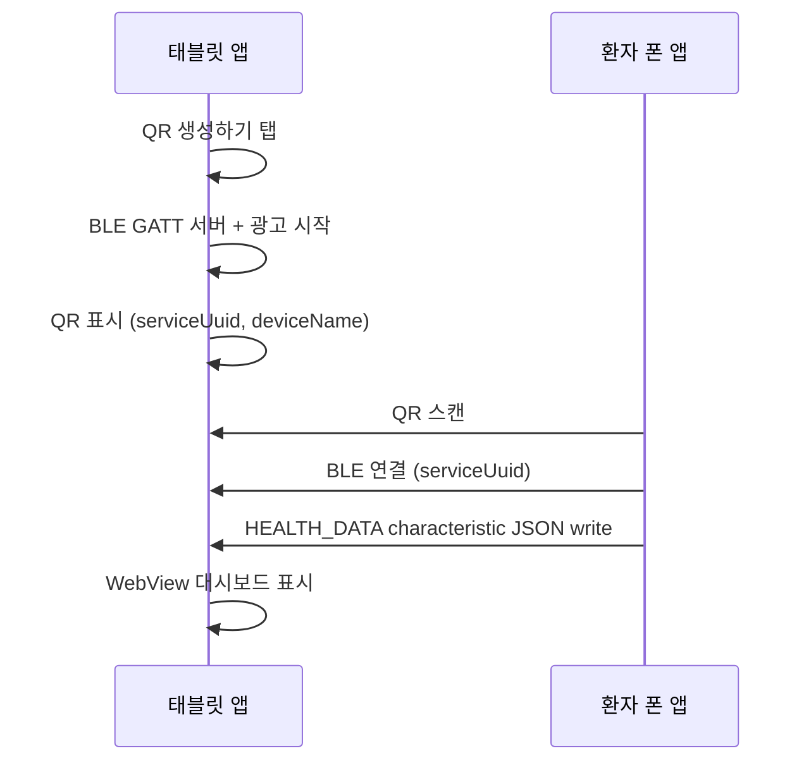

# CAMA Tablet (오프라인 BLE 수신 태블릿)

인터넷 연결 없이 동작하는 태블릿 앱입니다. 태블릿이 QR을 생성하고, 환자 휴대폰 앱이 QR을 스캔한 뒤 블루투스(BLE)로 건강 데이터를 전송하면 WebView 대시보드에 표시합니다.

## 구조

```
cama-tablet/
├── android/          # Kotlin 네이티브 (WebView + BLE GATT 서버 + 브릿지)
├── ios/              # Swift 네이티브 (WKWebView + BLE Peripheral + 브릿지) — iPad
└── web/              # React/Vite SPA → Android assets / iOS Resources에 번들
```

| 레이어 | 역할 |
|--------|------|
| **android** | WebView 호스트, BLE Peripheral(GATT 서버), QR 식별정보 생성, JS 브릿지 |
| **ios** | WKWebView 호스트, BLE Peripheral(`CBPeripheralManager`), 동일 JS 브릿지 (iPad) |
| **web** | 홈(QR 생성), 대기(QR 표시), 대시보드(걸음수·심박·문의 차트) |

기존 `cama-tablet-android` / `cama-tablet-web` / `cama-tablet-server`(서버 기반 QR **스캔**)와 달리, 이 앱은:

- **오프라인** — 웹앱이 APK `assets/www/`에 번들됨 (`file://` 로드)
- **QR 생성** — 태블릿이 BLE service UUID를 담은 QR을 표시
- **BLE 수신** — 폰 앱이 GATT characteristic에 JSON write

## 빌드

### 1. 웹앱 → Android assets + iOS Resources

```bash
cd cama-tablet
./scripts/build-web.sh
# 출력: android/app/src/main/assets/www/ 및 ios/CamaTablet/Resources/www/
```

### 2. Android APK

```bash
cd cama-tablet/android
./gradlew assembleDebug
# APK: app/build/outputs/apk/debug/app-debug.apk
```

### 3. iOS (iPad)

```bash
open cama-tablet/ios/CamaTablet.xcodeproj
# 또는
cd cama-tablet/ios
xcodebuild -scheme CamaTablet -destination 'platform=iOS Simulator,name=iPad Pro 13-inch (M5)' build
```

상세: [ios/README.md](ios/README.md)

### 브라우저 개발 (UI만)

```bash
cd cama-tablet/web
npm run dev
# http://localhost:5176 — "테스트 데이터 수신" 버튼으로 대시보드 확인
```

## 사용자 흐름



## 네이티브 ↔ WebView 브릿지

### Web → Native (`JavascriptInterface`)

| 메서드 | 설명 |
|--------|------|
| `generateQr()` | BLE 세션 시작 + QR payload 생성 |
| `stopBleSession()` | BLE 광고/서버 중지 |
| `getCapabilities()` | `{ offline, blePeripheral, qrGenerate, deviceInfo }` |

객체 이름: `AndroidBridge`, `CamaTabletBridge` (동일 인스턴스)

### Native → Web (`CustomEvent`)

이벤트명: `cama-tablet-native`

| `detail.type` | 설명 |
|---------------|------|
| `bridgeReady` | WebView 페이지 로드 완료 |
| `bleSessionStarted` | `payload.qrPayload` — QR에 인코딩할 JSON 문자열 |
| `bleConnected` | 폰 연결됨 (`payload.deviceName`) |
| `bleDisconnected` | 연결 해제 |
| `healthDataReceived` | 건강 데이터 수신 → 대시보드 이동 |
| `bleError` | 오류 (`error` 메시지) |
| `bleSessionStopped` | 세션 종료 |

## QR Payload (폰 앱이 스캔)

```json
{
  "v": 1,
  "app": "cama-tablet",
  "deviceId": "<android_id>",
  "deviceName": "CAMA-Tablet-XXXX",
  "serviceUuid": "F47AC10B-58CC-4372-A567-0E02B2C3D479",
  "dataCharUuid": "6BA7B810-9DAD-11D1-80B4-00C04FD29E95"
}
```

폰 앱은 `serviceUuid`로 BLE 스캔·연결 후 `dataCharUuid` characteristic에 아래 JSON을 **write** 합니다.

## 건강 데이터 JSON (폰 → 태블릿)

```json
{
  "patientName": "홍길동",
  "patientId": "user-001",
  "steps": 8432,
  "stepsHistory": [
    { "date": "07-02", "steps": 6200 },
    { "date": "07-08", "steps": 8432 }
  ],
  "heartRate": 72,
  "heartRateHistory": [
    { "time": "10:00", "bpm": 74 }
  ],
  "inquiries": [
    {
      "title": "혈압 관리",
      "preview": "아침 혈압을 기록해 주세요.",
      "updatedAt": "2026-07-05"
    }
  ]
}
```

## BLE 상수

| 항목 | UUID |
|------|------|
| Service | `F47AC10B-58CC-4372-A567-0E02B2C3D479` |
| Health Data (write) | `6BA7B810-9DAD-11D1-80B4-00C04FD29E95` |
| Status (notify) | `6BA7B811-9DAD-11D1-80B4-00C04FD29E95` |

## 폰 앱 연동 체크리스트

1. QR 스캔 후 `serviceUuid`로 BLE 연결
2. `dataCharUuid`에 UTF-8 JSON write (한 번에 또는 청크)
3. JSON은 `}` 로 끝나야 태블릿이 수신 완료로 인식
4. `cama-plus-app` 등 기존 앱에 BLE Central 클라이언트 추가 필요 (현재 미구현)

## 권한 (Android)

- `BLUETOOTH_CONNECT`, `BLUETOOTH_ADVERTISE` (API 31+)
- `ACCESS_FINE_LOCATION` (API 30 이하 BLE 광고용)

## 패키지

- Application ID: `com.cama.tablet.offline`
- minSdk: 26 (BLE GATT 서버 안정성)
