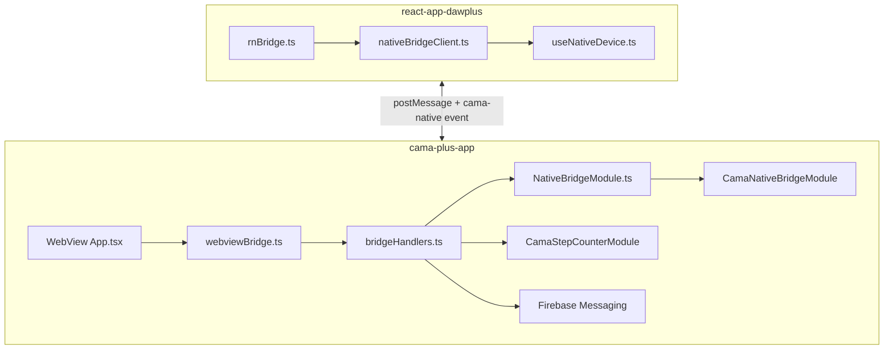

# CAMA Plus WebView 네이티브 브릿지 명세

> **작성일:** 2026-06-20  
> **대상:** `cama-plus-app` (RN WebView 호스트) ↔ `react-app-dawplus` (SPA)  
> **플랫폼:** Android · iOS (공통 프로토콜, 네이티브 stub → 추후 SDK 연동)

---

## 1. 아키텍처



| 레이어 | 경로 | 역할 |
|--------|------|------|
| SPA 클라이언트 | `react-app-dawplus/src/lib/webview/nativeBridgeClient.ts` | `requestNative*` 함수 |
| SPA 타입 | `react-app-dawplus/src/lib/webview/nativeBridge.types.ts` | 프로토콜 DTO |
| SPA 훅 | `react-app-dawplus/src/hooks/useNativeDevice.ts` | React 훅 |
| RN 라우터 | `cama-plus-app/src/utils/webviewBridge.ts` | postMessage 수신 |
| RN 디스패처 | `cama-plus-app/src/utils/bridgeHandlers.ts` | 요청별 처리 |
| RN JS 래퍼 | `cama-plus-app/src/native/NativeBridgeModule.ts` | NativeModules 호출 |
| Android 네이티브 | `android/.../nativebridge/CamaNativeBridgeModule.java` | stub / 추후 구현 |
| iOS 네이티브 | `ios/CamaApp/CamaNativeBridge.m` | stub / 추후 구현 |
| 걸음수 | `android/.../stepcounter/CamaStepCounterModule.java` | **Android 구현 완료** |

**WebView URL**

| 빌드 | URL |
|------|-----|
| Debug (`__DEV__`) | `http://localhost:5173/` |
| Release | `https://camaplus.cafe24.com/webview` |

에뮬레이터 Debug 테스트: `adb reverse tcp:5173 tcp:5173`

---

## 2. 통신 프로토콜

### 2.1 SPA → RN (postMessage)

모든 JSON 요청은 **`requestId`** (UUID) 필수.

| type | options | 설명 |
|------|---------|------|
| `getStepCount` | — | 오늘 걸음수 (Android STEP_COUNTER) |
| `getFcmToken` | — | FCM 토큰 + 기기명 (로그인용) |
| `getCapabilities` | — | 카메라/GPS/생체/센서 지원·구현 상태 |
| `capturePhoto` | `CameraCaptureOptions` | 카메라 촬영 |
| `pickPhoto` | `CameraCaptureOptions` | 앨범 선택 |
| `getCurrentLocation` | `LocationOptions` | GPS 1회 |
| `readVital` | `vitalTypeCd` | 심박·SpO2 등 센서/웨어러블 |
| `checkBiometricAvailable` | — | 생체인식 등록 여부 |
| `authenticateBiometric` | `BiometricAuthOptions` | Face ID / 지문 인증 |
| `goNativeHome` | — | (레거시) RN 홈 복귀 |

문자열 `"navigationStateChange"`: SPA 라우팅 변경 알림.

### 2.2 RN → SPA (CustomEvent)

```javascript
window.dispatchEvent(new CustomEvent('cama-native', { detail: { ... } }));
```

| detail.type | ok=true 필드 | ok=false |
|-------------|--------------|----------|
| `stepCount` | `steps` | `error` |
| `fcmToken` | `firebase: { device, platform, token }` | `error` |
| `capabilities` | `capabilities: DeviceCapabilities` | `error` |
| `cameraCapture` | `uri`, `base64`, `width`, `height` | `error` |
| `location` | `latitude`, `longitude`, `accuracy`, `timestamp` | `error` |
| `vitalReading` | `vitalTypeCd`, `valueNum`, `unit`, `measuredAt` | `error` |
| `biometric` | `mode`, `available`, `authenticated`, `biometryType` | `error` |

### 2.3 WebView bootstrap

`injectedJavaScript`에서 설정:

- `window.__CAMA_NATIVE_BRIDGE__ = true`
- `window.__CAMA_NATIVE_BRIDGE_VERSION__ = 2`
- `history.pushState/replaceState` hook → `navigationStateChange`

SPA 감지: `isReactNativeWebView()` — `ReactNativeWebView` 또는 `__CAMA_NATIVE_BRIDGE__`.

### 2.4 에러 코드

| 코드 | 의미 |
|------|------|
| `NOT_IMPLEMENTED` | stub — 네이티브 SDK 미연동 |
| `PERMISSION_DENIED` | 권한 거부 |
| `UNAVAILABLE` | WebView 외 / 모듈 없음 |
| `CANCELLED` | 사용자 취소 |
| `TIMEOUT` | SPA 타임아웃 |
| `INVALID_ARGUMENT` | 잘못된 파라미터 |

---

## 3. 구현 상태 (2026-06-20)

| 기능 | Android | iOS | SPA API |
|------|---------|-----|---------|
| 걸음수 | ✅ `CamaStepCounterModule` | ⏳ Core Motion 예정 | `requestNativeStepCount()` |
| FCM 토큰 | ✅ `@react-native-firebase/messaging` | ✅ 동일 | `requestNativeFcmToken()` → 로그인 |
| capabilities | ✅ stub (implemented: false) | ✅ stub | `requestNativeCapabilities()` |
| 카메라 | ⏳ stub | ⏳ stub | `requestNativeCapturePhoto()` |
| 앨범 | ⏳ stub | ⏳ stub | `requestNativePickPhoto()` |
| GPS | ⏳ stub | ⏳ stub | `requestNativeLocation()` |
| 센서/심박 | ⏳ stub | ⏳ stub | `requestNativeVitalReading()` |
| 생체인식 | ⏳ stub | ⏳ stub | `requestNativeBiometricAuth()` |

**서버 연동**

- FCM: `AccountServiceImpl.firebaseToken()` — `web-no-fcm`이 기존 FCM 덮어쓰기 **방지**
- 심박 저장: `PUT /api/webview/track/service/vital` — SPA `saveHeartRateRecord()` (수동/브릿지 결과 업로드)

---

## 4. 권한 (선언 완료)

### Android (`AndroidManifest.xml`)

- `CAMERA`, `READ_MEDIA_IMAGES`, `ACCESS_FINE_LOCATION`, `ACCESS_COARSE_LOCATION`
- `USE_BIOMETRIC`, `USE_FINGERPRINT`, `ACTIVITY_RECOGNITION`, `POST_NOTIFICATIONS`

### iOS (`Info.plist`)

- `NSCameraUsageDescription`, `NSPhotoLibraryUsageDescription`
- `NSLocationWhenInUseUsageDescription`, `NSMotionUsageDescription`
- `NSFaceIDUsageDescription`, `NSHealthShareUsageDescription`, `NSHealthUpdateUsageDescription`

---

## 5. SPA 사용 예

```typescript
import {
  requestNativeCapabilities,
  requestNativeStepCount,
  requestNativeFcmToken,
} from "@/lib/webview/rnBridge";
import { useNativeBiometric, useNativeLocation } from "@/hooks/useNativeDevice";

// 로그인 시 (firebaseWeb.ts 내부)
const firebase = await requestNativeFcmToken();

// 기능 가능 여부
const caps = await requestNativeCapabilities();
if (caps.ok && caps.data.capabilities?.camera.implemented) {
  // ...
}

// 걸음수 (코칭 StepCountPopup)
const steps = await requestNativeStepCount();
```

---

## 6. 추후 네이티브 구현 가이드

| 기능 | Android | iOS |
|------|---------|-----|
| 카메라 | CameraX / Intent | `UIImagePickerController` |
| GPS | FusedLocationProvider | `CLLocationManager` |
| 생체인식 | `BiometricPrompt` | `LocalAuthentication` |
| 심박/웨어러블 | Health Connect, Samsung Health | HealthKit |

구현 후 `CamaNativeBridgeModule.getCapabilities()`에서 해당 항목 `implemented: true`로 변경.

---

## 7. 빌드 · 테스트

```powershell
# APK (Release)
cd cama-plus-app\android
$env:JAVA_HOME = "C:\Program Files\Microsoft\jdk-17.0.19.10-hotspot"
.\gradlew.bat assembleRelease

# 출력: android\app\build\outputs\apk\release\app-release.apk
# 배포용 복사: dist\cama-plus-cafe24-2026-06-20-bridge.apk
```

### 7.2 모바일 접속 (2026-06-20)

| 확인 | 결과 |
|------|------|
| iPhone / Android UA | 서버 HTML·JS **데스크톱과 동일** (HTTP 200) |
| 원인 | 구버전 JS **브라우저 캐시** + 라우트 미매칭 시 `NotFound`(「개발 진행중」) |
| 조치 | `index.html` no-cache, 라우트 상대경로 수정, 미매칭→`/login` 리다이렉트 |

모바일에서 여전히 이전 화면이 보이면: **Safari/Chrome 설정 → 방문 기록 및 데이터 삭제** 또는 시크릿 탭으로 [관리자](https://camaplus.cafe24.com/admin/) 재접속.

| 항목 | 결과 |
|------|------|
| AVD | `CAMA_API33` |
| APK | `dist/cama-plus-cafe24-2026-06-20-bridge.apk` (~18.6 MB) |
| 설치 | `adb install -r` Success |
| 앱 기동 | `com.camaplus.app/.MainActivity` 정상 |
| WebView | Release → `https://camaplus.cafe24.com/webview` 로그인 화면 표시 |
| 스크린샷 | `dist/emulator-bridge-test.png` |
| 스크립트 | `python deploy/scripts/test-native-bridge-emulator.py --apk dist/...` |

**Debug 빌드 참고:** WebView가 `http://localhost:5173/` 이므로 Metro(`8081`) + Vite(`5173`)를 **동시에** 띄우고 `adb reverse` 두 포트 모두 필요. Metro와 Vite가 같은 포트를 쓰면 충돌함.

```powershell
adb reverse tcp:8081 tcp:8081
adb reverse tcp:5173 tcp:5173
cd react-app-dawplus; npm run dev
# 별도 터미널: cd cama-plus-app; npm start
cd cama-plus-app\android; .\gradlew.bat assembleDebug
adb install -r app\build\outputs\apk\debug\app-debug.apk
```

---

## 8. 관련 문서

- [CAFE24_REACT_NATIVE_BRIDGE_ANALYSIS_2026-06-17.md](./CAFE24_REACT_NATIVE_BRIDGE_ANALYSIS_2026-06-17.md) — 이전 분석
- [CAFE24_VITAL_HEART_RATE.md](./CAFE24_VITAL_HEART_RATE.md) — 심박 API·DB
- [CAFE24_SESSION_HANDOFF_2026-06-19.md](./CAFE24_SESSION_HANDOFF_2026-06-19.md) — FCM 이슈 핸드오프
