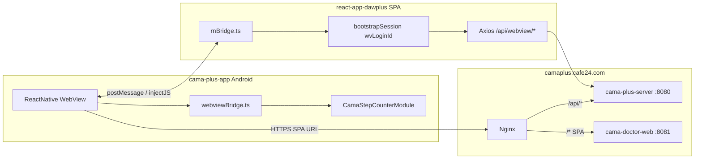

# react-app-dawplus ↔ cama-plus-app 브릿지·API 검증 보고서

> **작성일:** 2026-06-17 · **갱신:** 2026-06-17 (`react-app-dawplus` 모노레포 통합)  
> **대상:** `F:\cama_pjt\cama-cafe24` (모노레포 — `react-app-dawplus` 포함)  
> **API 베이스:** `https://camaplus.cafe24.com`  
> **APK:** `dist/cama-plus-cafe24-2026-06-17.apk` (약 20.3 MB)

---

## 1. 디렉터리 구조 (MD 문서 기준)

| 경로 | 역할 | 비고 |
|------|------|------|
| `cama-cafe24/cama-plus-app/` | **환자 Android RN 앱** (WebView 호스트) | APK 빌드·실기기 테스트용 **정본** |
| `cama-cafe24/react-app-dawplus/` | **React SPA** (환자 WebView) | `https://camaplus.cafe24.com` 서빙 · `npm run build:cafe24` → `../deploy/` |
| `cama-cafe24/cama-plus-server/` | REST API (Spring Boot) | VPS `cama-plus-server` 컨테이너 |
| `cama-cafe24/cama-tablet-*` | 태블릿 QR 대시보드 (별도) | 환자 앱과 독립 |

**문서 근거:** `docs/CAFE24_WORK_STATUS_AND_TODO.md`, `docs/CAFE24_SESSION_HANDOFF_2026-06-12-TABLET-VITAL-BATCH.md`, `docs/CAFE24_CURSOR_HANDOFF.md`

---

## 2. 아키텍처 요약



---

## 3. WebView URL 매핑 (네이티브 → SPA)

`cama-plus-app/src/config/webviewUrls.ts`:

| RN 화면 | SPA URL | 쿼리 |
|---------|---------|------|
| 코칭 허브 | `/coaching/` | `?wvLoginId={loginId}` |
| 웰빙 | `/wellbeing` | `?wvLoginId={loginId}` |
| 수면/식사/신체/마음 | `/coaching/sleep` 등 | 카테고리별 SPA 직접 진입 |
| 도움말 | `/webview/help` | 레거시 |
| 치료 상세 | `/webview/treatment/{seq}` | 레거시 |

`stage.ts` 의 `currentStage = 'PROD'` → 호스트 `https://camaplus.cafe24.com`

---

## 4. 브릿지 프로토콜 매트릭스

### 4.1 활성 메시지 (SPA ↔ RN 연결됨)

| 방향 | 메시지 | 네이티브 (`webviewBridge.ts`) | SPA (`rnBridge.ts`) | 검증 |
|------|--------|------------------------------|---------------------|------|
| Web → RN | `"navigationStateChange"` (문자열) | `onNavigationStateChange` 콜백 | `notifyWebViewNavigation()` — help·콘텐츠 상세 | ✅ 정적 스크립트 |
| Web → RN | `{type:"getStepCount", requestId}` | `CamaStepCounterModule` → 걸음수 | `requestNativeStepCount()` | ✅ `verify-step-bridge.mjs` |
| RN → Web | `cama-native` CustomEvent `{type:"stepCount",...}` | `injectJavaScript` | `addEventListener('cama-native')` | ✅ |
| Web → RN | `{type:"goNativeHome"}` | `onGoNativeHome` → RN 홈 탭 | `requestNativeHome()` — `PatientWebViewToolbarHeader` | ✅ 코드 일치 |
| RN → Web | `sessionStorage` bootstrap | `getWebviewSessionBootstrapScript` | `bootstrapSession` + `wvLoginId` | ✅ 운영 URL 200 |

### 4.2 레거시 (네이티브만 처리, SPA 미사용)

| 메시지 | 네이티브 | SPA 현황 |
|--------|----------|----------|
| `{type:"TS", data:"..."}` | `react-native-tts` | TTS는 Web Speech API (`useTTS`) |
| `{type:"TP"}` | TTS stop | 미사용 |
| `{type:"BS"}` / 기타 | bottom sheet 토글 | `PatientWebViewToolbarHeader` 로 대체 |

**결론:** 코칭·웰빙·걸음수·홈 복귀·세션 부트스트랩은 **정상 연결**. TTS/BS 레거시는 **기능 저하 없음** (SPA가 웹 API 사용).

### 4.3 SPA WebView 전용 UI

- `isReactNativeWebView()` — dockbar 숨김, 로그인 리다이렉트 스킵
- `useNativeStepCount` — 웰빙/코칭 걸음수 카드
- `PatientWebViewToolbarHeader` — 네이티브 홈 버튼

---

## 5. Cafe24 API E2E 결과

**스크립트:** `deploy/scripts/cafe24-app-api-e2e.py`  
**계정:** `happycog` (자동 reset-password)

| 구분 | 결과 |
|------|------|
| 총 34건 | **OK 34 / FAIL 0 / SKIP 1** |
| SKIP | `POST /api/track/service/info` — HTTP 500 (해당 계정에 여정 데이터 없음, 연결성과 무관) |

**WebView/SPA 라우트:** `verify-webview-routes.mjs` — 9개 parity 파일 **전부 OK**

### 5.1 생체신호·QR API (추가 검증)

**스크립트:** `deploy/scripts/test-vital-qr-api.py`

| API | 최종 결과 | 비고 |
|-----|-----------|------|
| `POST /api/tablet/qr/issue` | ✅ 200 | JWT v2 QR 발급 |
| `PUT /api/track/service/vital` | ✅ 200 | 심박 저장 |
| `POST /api/track/service/vitalList` | ✅ 200 | 이력 조회 |

### 5.2 이번 세션에서 수정·재배포한 서버 버그

| 이슈 | 원인 | 수정 |
|------|------|------|
| Vital API 404 | `VitalRestController`에 `@RequestMapping("api")` 누락 | 컨트롤러에 `api` prefix 추가 |
| Vital API 500 | `mybatis-config.xml`에 `VitalMapper.xml` 미등록 | mapper 등록 후 VPS 재배포 |

**배포:** `vps-deploy-server-src.py` (2026-06-17 2회)

---

## 6. APK 빌드

| 항목 | 값 |
|------|-----|
| 프로젝트 | `cama-plus-app/android` |
| JDK | **17** (`C:\Program Files\Microsoft\jdk-17.0.19.10-hotspot`) |
| 명령 | `gradlew.bat assembleRelease` |
| 산출물 | `cama-plus-app/android/app/build/outputs/apk/release/app-release.apk` |
| 배포 복사 | `dist/cama-plus-cafe24-2026-06-17.apk` |

**빌드 이슈:** `android/app/src/main/res/drawable-*/node_modules_*` 15개 파일이 Gradle 생성 리소스와 **중복** → 삭제 후 빌드 성공.

> **재발 방지:** release 빌드 전 `Get-ChildItem -Recurse .../res -Filter node_modules_* | Remove-Item` 실행 (문서: `CAFE24_CURSOR_HANDOFF.md`)

---

## 7. 실기기 테스트 체크리스트

1. `dist/cama-plus-cafe24-2026-06-17.apk` 설치 (USB 또는 adb)
2. `happycog` 로그인 (비밀번호 찾기로 임시 PW 발급 가능)
3. 코칭 탭 → WebView `https://camaplus.cafe24.com/coaching/?wvLoginId=...` 로딩
4. 웰빙 탭 → 걸음수 카드에 **네이티브 걸음수** 표시 여부
5. 코칭 헤더 **홈으로** → RN 메인 탭 복귀
6. 도움말·콘텐츠 상세 → RN 뒤로가기 동작 (`navigationStateChange`)

---

## 8. 알려진 갭·후속 작업

| 우선순위 | 항목 | 상태 |
|----------|------|------|
| 낮음 | SPA에서 TS/TP/BS 미사용 | Web Speech TTS로 대체, 문제 없음 |
| 낮음 | `react-app-dawplus` 원격(GitHub) 동기화 | 로컬 정본: `cama-cafe24/react-app-dawplus/` (2026-06-17 `F:\cama_pjt\react-app-dawplus` → 모노레포 이전) |
| 중간 | `cafe24-app-api-e2e.py`에 vital·QR 케이스 통합 | 별도 `test-vital-qr-api.py` 로 검증 완료 |
| 중간 | 환자 앱 UI에서 QR 표시·심박 업로드 | API 준비됨, RN 화면 연동은 T1/T2 TODO |
| 낮음 | `/api/enums` permitAll 401 | 기존 이슈, 앱 핵심 플로우 무관 |

---

## 9. 검증 명령 요약

```powershell
cd F:\cama_pjt\cama-cafe24

# 브릿지·라우트
node deploy/scripts/verify-step-bridge.mjs
node deploy/scripts/verify-webview-routes.mjs

# API E2E
python deploy/scripts/cafe24-app-api-e2e.py
python deploy/scripts/test-vital-qr-api.py

# APK (JDK 17)
$env:JAVA_HOME = "C:\Program Files\Microsoft\jdk-17.0.19.10-hotspot"
Get-ChildItem -Recurse cama-plus-app/android/app/src/main/res -Filter node_modules_* | Remove-Item -Force
cd cama-plus-app/android
.\gradlew.bat assembleRelease
```

---

## 10. 결론

- **네이티브 앱 위치:** `cama-cafe24/cama-plus-app` (문서·MD와 일치)
- **브릿지:** 활성 프로토콜(세션·걸음수·홈·네비게이션) **코드·정적 검증 통과**
- **Cafe24 API:** 환자/WebView 핵심 API **34/34 OK** (+ vital·QR **3/3 OK**)
- **APK:** `dist/cama-plus-cafe24-2026-06-17.apk` — 실기기 테스트 가능

---

## 11. 후속 작업 (2026-06-17 세션)

| 항목 | 상태 | 문서 |
|------|------|------|
| Super Admin **APK 관리** 메뉴·API·배포 | ✅ | [SESSION 06-17 APK-ADMIN](CAFE24_SESSION_HANDOFF_2026-06-17-APK-ADMIN.md) §6 |
| APK 공개 다운로드 `/apk_down/` | ✅ | https://camaplus.cafe24.com/apk_down/cama-plus-cafe24-2026-06-17.apk |
| 관리자 로그인 `cama` / `cama!` | ✅ | [SESSION 06-17 §7](CAFE24_SESSION_HANDOFF_2026-06-17-APK-ADMIN.md) |
| 에뮬레이터 CAMA_API33 | ✅ 설치·실행 | 수동 로그인 필요 |
