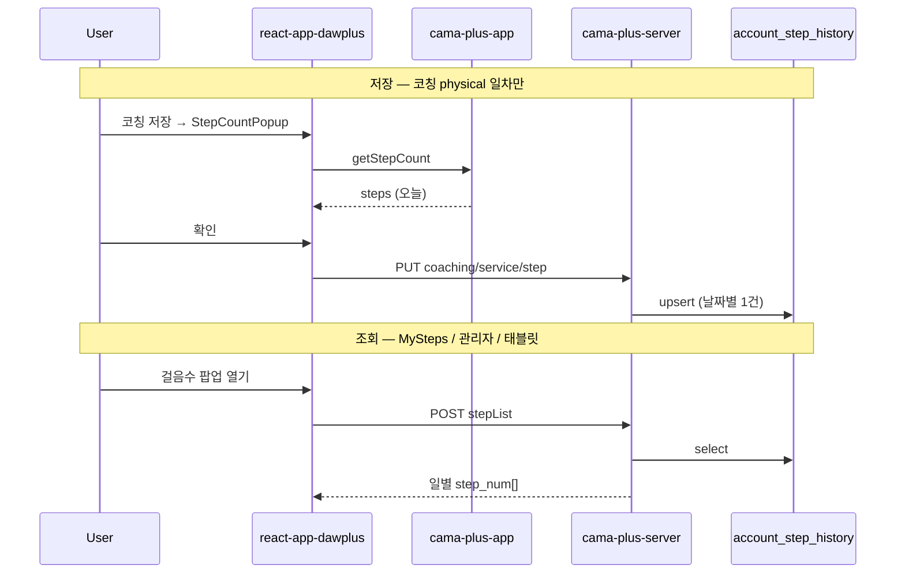

# Cafe24 걸음수 수집·저장 구현 설계

> **작성일:** 2026-06-20  
> **연관:** [CAFE24_USER_HEALTH_DATA.md](CAFE24_USER_HEALTH_DATA.md) · [CAFE24_NATIVE_BRIDGE.md](CAFE24_NATIVE_BRIDGE.md)

---

## 1. 한 줄 요약

| 항목 | 상태 |
|------|------|
| 단말 걸음수 **읽기** (Android/iOS) | ✅ 구현됨 |
| 서버 **저장 API** | ✅ 구현됨 |
| **앱 실행 시 자동 전송** | ❌ 미구현 |
| **매일 저녁 자동 전송** | ❌ 미구현 |
| **실제 저장 트리거** | 신체활동(physical) 코칭에서 사용자 확인 시만 |

---

## 2. 서버 저장 구조

### 테이블: `account_step_history`

| 컬럼 | 설명 |
|------|------|
| `account_seq` | 사용자 |
| `execution_date` | 날짜 (`YYYY-MM-DD`) |
| `step_num` | 해당 일 총 걸음수 |

**규칙:** `account_seq` + `execution_date` 당 **1행**. 같은 날 재전송 시 `step_num` **UPDATE**.

서버 배치·cron으로 걸음수를 수집하지 **않음**. 클라이언트 API 호출 시에만 DB 반영.

### API

| Method | 경로 | 용도 |
|--------|------|------|
| PUT | `/api/track/service/step` | 앱 JWT 저장 |
| PUT | `/api/webview/track/service/step` | WebView (`accountSeq` body) |
| PUT | `/api/coaching/service/step` | 코칭 (`loginId` → account 조회) |
| POST | `/api/track/service/stepList` | 일별 목록 조회 |
| POST | `/api/webview/track/service/stepList` | WebView 목록 조회 |

**요청 예**

```json
{
  "accountSeq": 121,
  "executionDate": "2026-06-20",
  "stepNum": 5432
}
```

---

## 3. 네이티브 앱 (cama-plus-app)

### 3.1 플랫폼별 센서

| OS | 모듈 | 방식 |
|----|------|------|
| Android | `CamaStepCounterModule` | `Sensor.TYPE_STEP_COUNTER` + `SharedPreferences` 기준값 |
| iOS | `CamaStepCounter` | HealthKit `HKQuantityTypeIdentifierStepCount` (당일 합계) |

권한:

- Android: `ACTIVITY_RECOGNITION`
- iOS: `NSMotionUsageDescription`, `NSHealthShareUsageDescription`

### 3.2 WebView 브릿지

```text
SPA postMessage { type: "getStepCount", requestId }
    → bridgeHandlers.ts → getTodayStepCountFromDevice()
    → postMessage { type: "stepCount", requestId, steps }
```

| 파일 | 역할 |
|------|------|
| `src/utils/bridgeHandlers.ts` | `getStepCount` 처리 |
| `src/native/StepCounter.android.ts` | Android 네이티브 호출 |
| `src/native/StepCounter.ios.ts` | iOS 네이티브 호출 |
| `android/.../CamaStepCounterModule.java` | Android 구현 |
| `ios/.../CamaStepCounter.m` | iOS 구현 |

### 3.3 App.tsx

- WebView 로드 + FCM foreground 리스너만 존재
- **앱 기동·포그라운드 시 걸음수 자동 read/upload 없음**

---

## 4. Web SPA (react-app-dawplus)

### 4.1 현재 저장 흐름 (유일한 업로드 경로)

```text
신체활동 코칭 (physical day0~16)
  → DayStepFlow 저장 단계
  → StepCountPopup 열림
  → useNativeStepCount().fetchSteps()  (WebView일 때만)
  → 입력란에 걸음수 채움
  → 사용자 [확인] 클릭
  → useSaveCoachingStep()
  → PUT /api/coaching/service/step
```

| 파일 | 역할 |
|------|------|
| `StepCountPopup.tsx` | 팝업 UI + 네이티브 걸음수 자동 채움 |
| `useNativeStepCount.ts` | `requestNativeStepCount()` 래퍼 |
| `useCoachingMutations.ts` | `useSaveCoachingStep` |
| `apis/api/webview/coaching.ts` | `saveCoachingStep` API |
| `physical/day*/index.tsx` | 일차별 `handleStepCountConfirm` |

### 4.2 조회만 하는 화면

| 화면 | 동작 |
|------|------|
| `MySteps.tsx` (헤더 걸음수 팝업) | `POST stepList` 조회·차트 표시만 |
| 관리자 모니터링 | `MonitorMapper` `avg_step` 집계 조회 |
| 태블릿 대시보드 | `account_step_history` 최근 14일·오늘·7일 평균 |

### 4.3 SPA에 없는 것

- `PUT /api/webview/track/service/step` 클라이언트 함수 (track API에 **저장** 메서드 미정의)
- 로그인/홈 진입 시 자동 sync
- `AppState` / 포그라운드 리스너 기반 sync
- 백그라운드·저녁 스케줄 작업

---

## 5. 데이터 흐름 (현재)



---

## 6. 미구현 시나리오 (설계 참고)

### 6.1 앱 실행·포그라운드 시 자동 전송

**가능:** 인프라 이미 있음 (native read + server PUT).

```text
로그인 완료 또는 AppState === 'active'
  → requestNativeStepCount()
  → PUT /api/webview/track/service/step
     { accountSeq, executionDate: today, stepNum }
```

| 항목 | 내용 |
|------|------|
| 난이도 | 낮음~중간 |
| 중복 전송 | 같은 날 UPDATE → 문제 없음 |
| 권한 | Android ACTIVITY_RECOGNITION, iOS HealthKit 동의 필요 |
| 구현 위치 후보 | SPA `_auth/_layout.tsx`, `useNativeStepCount` + 신규 `syncTodaySteps()` |

### 6.2 매일 저녁 자동 전송

**서버만으로는 불가** (걸음수는 단말 로컬 데이터).

| 방식 | 설명 | 난이도 |
|------|------|--------|
| A. 포그라운드 sync | 저녁에 앱을 쓰면 그때 반영 | 낮음 (6.1과 동일) |
| B. 로컬 알림 | “걸음 기록” 알림 → 사용자 앱 실행 | 중간 |
| C. OS 백그라운드 | WorkManager / BGTaskScheduler | 높음 (OS 제한) |
| D. FCM 데이터 메시지 | 서버 push → 앱 wake → sync | 중간~높음 |

실무 권장: **6.1 포그라운드 sync** 먼저, 필요 시 **B 로컬 알림** 추가.

---

## 7. 구현 시 체크리스트 (향후)

### 앱 실행 시 자동 sync

- [ ] `track.ts`에 `updateWebviewStep` (`PUT webview/track/service/step`) 추가
- [ ] `syncTodaySteps(accountSeq)` 유틸 (read native → PUT, 실패 시 silent log)
- [ ] WebView + 로그인 세션 있을 때 `_layout` 또는 홈 mount에서 1회 호출
- [ ] 동일 세션 중복 호출 방지 (예: `sessionStorage` 오늘 날짜 키)
- [ ] 권한 거부 시 UX (코칭 팝업과 동일하게 수동 입력 fallback)

### 저녁 자동 (선택)

- [ ] 로컬 알림 스케줄 (react-native-push-notification 등)
- [ ] 또는 FCM data message + background handler (Android 제한적)

---

## 8. 관련 파일 인덱스

| 구분 | 경로 |
|------|------|
| 서버 저장 | `cama-plus-server/.../TrackRestController.java`, `CareTrackMapper.xml` |
| 코칭 저장 | `CoachingRestController.java` (`coaching/service/step`) |
| Android 센서 | `cama-plus-app/android/.../CamaStepCounterModule.java` |
| iOS 센서 | `cama-plus-app/ios/.../CamaStepCounter.m` |
| 브릿지 | `cama-plus-app/src/utils/bridgeHandlers.ts` |
| SPA read | `react-app-dawplus/src/lib/webview/nativeBridgeClient.ts` |
| SPA upload | `react-app-dawplus/.../StepCountPopup.tsx`, `useCoachingMutations.ts` |
| SPA 조회 | `react-app-dawplus/.../MySteps.tsx`, `useTrackQueries.ts` |

---

*현재 설계: 코칭 기반 수동 확인 저장. 자동 sync는 §6·§7 참고하여 별도 스프린트에서 추가.*
