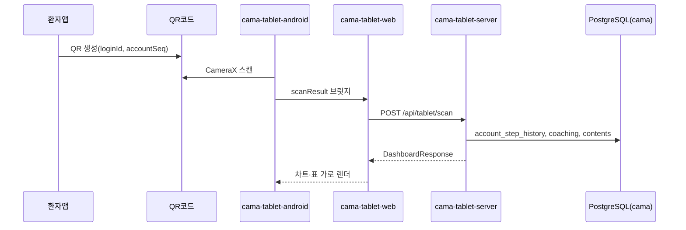

# CAMA Tablet QR Dashboard — 아키텍처 (초안)

> 환자 앱 QR → 태블릿 네이티브(카메라) → React 대시보드(가로) → Spring Boot API → 기존 `cama` DB

## 디렉터리

| 경로 | 역할 |
|------|------|
| `cama-tablet-android/` | Android 네이티브 — WebView + QR 카메라 스캔 |
| `cama-tablet-web/` | React(Vite) — 가로 대시보드 UI·차트 |
| `cama-tablet-server/` | Spring Boot 3.5 — 태블릿 전용 집계 API |

## 데이터 흐름



## QR 페이로드

### v2 (권장) — 서명·만료 JWT

환자 앱 로그인 후 발급:

```http
POST /api/tablet/qr/issue
api_key: <환자 JWT>
```

응답 `qrPayload` 를 QR로 인코딩:

```json
{
  "v": 2,
  "t": "eyJhbGciOiJIUzI1NiIs..."
}
```

- **서명**: HMAC-SHA256 (`CAMA_TABLET_QR_SECRET`, `cama-plus-server`·`cama-tablet-server` 동일 값)
- **만료**: 기본 **300초**(5분), `cama.tablet.qr.ttl-seconds` 로 조정
- **클레임**: `accountSeq`, `loginId`, `iss=cama-tablet-qr`

프로덕션에서는 `cama.tablet.qr.require-signed: true` 로 v1 차단.

### v1 (레거시·개발용)

```json
{ "v": 1, "loginId": "patient01", "accountSeq": 558 }
```

로컬 태블릿 서버 무인증 발급(개발만): `POST http://localhost:8090/api/tablet/qr/issue`  
(`allow-dev-issue: true`, body: `{ "accountSeq", "loginId", "devKey": "local-dev" }`)

## 기존 시스템 연동

| 데이터 | 소스 테이블/API |
|--------|-----------------|
| 발걸음 | `account_step_history` (`CareTrackMapper.getCareTrackStepList`) |
| 코칭 진행 | `coaching_user_answer_info` + `MonitorMapper` 패턴 |
| 의료진 문의 | `cm_contents` (치료정보 Q&A) — 1:1 QNA는 미구현, 스텁 |
| 심박수 (원시) | `account_vital_history` (`HEART_RATE`) — API: `PUT /api/track/service/vital` |
| 심박수 (통계) | `account_heart_rate_statistics` — 배치 00:30 KST · [VITAL](CAFE24_VITAL_HEART_RATE.md) |
| 태블릿 UI 심박 차트 | ⏳ `cama-tablet-server` 스텁 — 통계 테이블 연동 예정 |

## 로컬 실행

```powershell
# 1) API (포트 8090)
cd cama-tablet-server
mvn spring-boot:run -Dspring-boot.run.profiles=local

# 2) Web (포트 5175)
cd cama-tablet-web
npm install && npm run dev

# 3) Android — Android Studio에서 cama-tablet-android 열기
#    BuildConfig.TABLET_WEB_URL = http://10.0.2.2:5175 (에뮬레이터)
```

## VPS 배포 상태

| 모듈 | VPS |
|------|-----|
| `cama-plus-server` (QR issue, vital API) | ✅ 2026-06-12 |
| `cama-back-batch` (심박 통계) | ✅ 2026-06-12 |
| `cama-tablet-server` / web / android | ⏳ 로컬만 |

## 구현 상태 (2026-06-12)

| 모듈 | 상태 |
|------|------|
| `cama-tablet-server` | 스켈레톤 완료 — `mvn compile` OK, 포트 **8090** |
| `cama-tablet-web` | 스켈레톤 완료 — `npm run build` OK, 포트 **5175** |
| `cama-tablet-android` | 스켈레톤 완료 — `MainActivity`, `QrScanActivity`, WebView 브릿지 |

### API 엔드포인트

- `GET /api/tablet/health`
- `POST /api/tablet/scan` — QR JSON 파싱 후 `accountSeq` 검증 (v2 JWT 검증 포함)
- `GET /api/tablet/dashboard/{accountSeq}` — 발걸음·코칭·문의 집계
- `POST /api/tablet/qr/issue` — **cama-plus-server** 환자 인증 발급 / **tablet-server** 로컬 dev 발급

### 네이티브 ↔ 웹 브릿지

- JS: `window.AndroidBridge.startQrScan()` (또는 `CamaTabletBridge`)
- Native → Web: `CustomEvent('cama-tablet-native', { detail: { type, ok, payload } })`

## 다음 단계

1. 환자 앱(`cama-plus-app`)에 QR 생성 화면 추가
2. ~~QR 서명/만료 토큰~~ ✅ v2 JWT 적용됨 — VPS에 `CAMA_TABLET_QR_SECRET` 배포 후 `require-signed: true`
3. `cama-tablet-server`를 Cafe24 VPS에 배포 또는 `cama-plus-server`에 모듈 병합
4. ~~심박 테이블/API~~ ✅ — `account_vital_history` + plus-server API + 통계 배치
5. 태블릿 대시보드 심박 차트 — `account_heart_rate_statistics` 연동
6. Android Studio에서 `cama-tablet-android` 빌드·실기기/에뮬레이터 E2E
7. `CAMA_TABLET_QR_SECRET` VPS `.env` 설정

세션 상세: [CAFE24_SESSION_HANDOFF_2026-06-12-TABLET-VITAL-BATCH.md](CAFE24_SESSION_HANDOFF_2026-06-12-TABLET-VITAL-BATCH.md)
