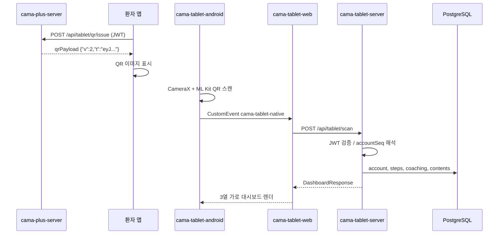
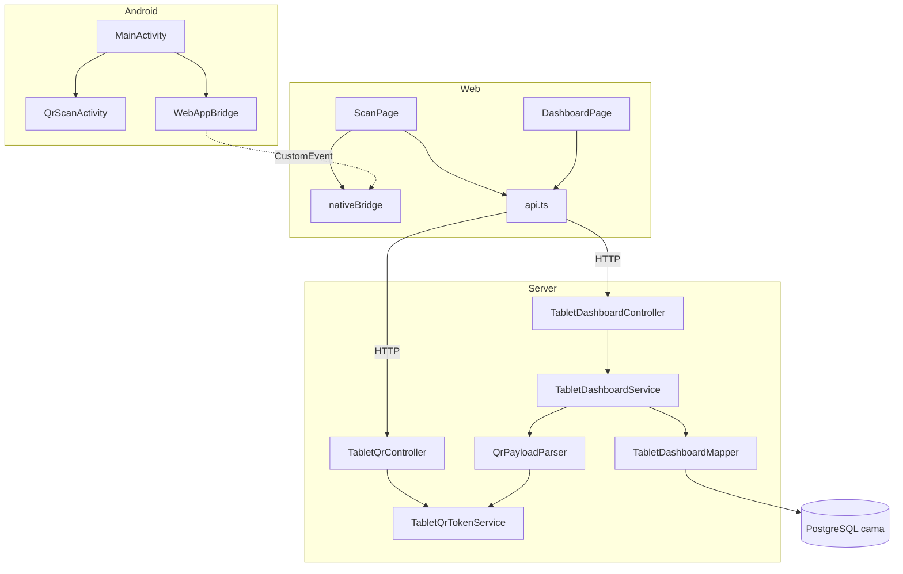

# CAMA Tablet 소스 분석

> 분석 기준일: 2026-07-09  
> 대상: `cama-tablet-android`, `cama-tablet-web`, `cama-tablet-server`  
> 관련: `cama-plus-server` (QR 발급), PostgreSQL `cama` DB

---

## 1. 개요

CAMA Tablet은 **병원/클리닉 태블릿**에서 환자 앱 QR을 스캔해 **건강 데이터 대시보드**를 가로 화면으로 보여주는 시스템이다.

| 구성요소 | 기술 스택 | 포트 | 역할 |
|----------|-----------|------|------|
| `cama-tablet-android` | Kotlin, WebView, CameraX, ML Kit | — | 네이티브 셸 + QR 카메라 |
| `cama-tablet-web` | React 18, TypeScript, Vite, Recharts | **5175** | 대시보드 SPA |
| `cama-tablet-server` | Spring Boot 3.5, MyBatis, JDK 21 | **8090** | QR 검증 + DB 집계 API |
| `cama-plus-server` | Spring Boot (기존) | **8080** | 환자 인증 QR 발급 (`/api/tablet/qr/issue`) |

### 전체 흐름



---

## 2. 디렉터리 구조

### 2.1 cama-tablet-android

```
cama-tablet-android/
├── app/
│   ├── build.gradle.kts          # BuildConfig.TABLET_WEB_URL, CameraX/ML Kit 의존성
│   └── src/main/
│       ├── AndroidManifest.xml   # landscape, INTERNET/CAMERA 권한
│       ├── java/com/cama/tablet/
│       │   ├── MainActivity.kt       # WebView 호스트, 브릿지 등록
│       │   ├── QrScanActivity.kt     # CameraX QR 스캔
│       │   └── WebAppBridge.kt       # @JavascriptInterface
│       └── res/layout/
│           ├── activity_main.xml
│           └── activity_qr_scan.xml
├── build.gradle.kts
└── settings.gradle.kts
```

### 2.2 cama-tablet-web

```
cama-tablet-web/
├── src/
│   ├── App.tsx                   # 라우팅: /, /dashboard/:accountSeq
│   ├── main.tsx
│   ├── index.css
│   ├── pages/
│   │   ├── ScanPage.tsx          # QR 스캔 진입 + API 호출
│   │   └── DashboardPage.tsx     # 3열 가로 레이아웃
│   ├── components/
│   │   ├── StepChart.tsx         # Recharts AreaChart (14일)
│   │   └── CoachingRadial.tsx    # conic-gradient 원형 진행률
│   ├── lib/
│   │   ├── api.ts                # axios → /api/tablet/*
│   │   └── nativeBridge.ts       # Android ↔ JS 브릿지
│   └── types/
│       └── dashboard.ts          # TypeScript 타입 정의
├── vite.config.ts                # proxy /api → :8090
└── package.json
```

### 2.3 cama-tablet-server

```
cama-tablet-server/
├── src/main/java/com/cama/tablet/
│   ├── RunApplication.java
│   ├── controller/
│   │   ├── TabletDashboardController.java   # health, scan, dashboard
│   │   └── TabletQrController.java          # dev QR 발급
│   ├── service/
│   │   ├── TabletDashboardService.java      # 대시보드 집계
│   │   ├── TabletQrTokenService.java        # JWT 발급/검증
│   │   └── QrPayloadParser.java             # QR 포맷 파싱
│   ├── mapper/
│   │   └── TabletDashboardMapper.java
│   ├── dto/                                 # 요청/응답 DTO
│   ├── domain/
│   │   └── ApiResult.java                   # { success, message, response }
│   └── config/
│       ├── TabletQrProperties.java
│       ├── TabletQrConfig.java
│       └── WebConfig.java                   # CORS
├── src/main/resources/
│   ├── application.yml
│   ├── application-local.yml
│   └── mapper/TabletDashboardMapper.xml
└── src/test/.../TabletQrTokenServiceTest.java
```

---

## 3. cama-tablet-android 상세

### 3.1 MainActivity — WebView 호스트

- `BuildConfig.TABLET_WEB_URL` 로 React SPA 로드
  - **debug**: `http://10.0.2.2:5175` (에뮬레이터 → PC Vite)
  - **release**: `https://camaplus.cafe24.com/tablet-app/`
- WebView 설정: `javaScriptEnabled`, `domStorageEnabled`, `MIXED_CONTENT_ALWAYS_ALLOW`
- `WebAppBridge`를 `AndroidBridge`, `CamaTabletBridge` 두 이름으로 등록 (웹 호환)
- QR 스캔 결과를 `evaluateJavascript`로 WebView에 주입

```kotlin
// 스캔 성공 시 WebView로 이벤트 전달
val script = "(function(){window.dispatchEvent(new CustomEvent('cama-tablet-native',{detail:${json}}));})();"
webView.evaluateJavascript(script, null)
```

이벤트 `detail` 구조:

| 필드 | 타입 | 설명 |
|------|------|------|
| `type` | `"scanResult"` | 고정 |
| `ok` | boolean | 스캔 성공 여부 |
| `payload` | string | QR 원문 |
| `error` | string? | 실패 시 메시지 |

### 3.2 QrScanActivity — 카메라 QR 인식

- **CameraX** `Preview` + `ImageAnalysis` (후면 카메라)
- **ML Kit** `BarcodeScanning` — `FORMAT_QR_CODE`만 처리
- `handled` 플래그로 중복 스캔 방지
- 카메라 권한: `ActivityResultContracts.RequestPermission`
- 결과: `EXTRA_QR_PAYLOAD` Intent extra → `MainActivity` Activity Result

### 3.3 WebAppBridge

```kotlin
@JavascriptInterface
fun startQrScan() { onStartQrScan() }
```

JS에서 `window.AndroidBridge.startQrScan()` 또는 `window.CamaTabletBridge.startQrScan()` 호출.

### 3.4 매니페스트·빌드

- `screenOrientation="landscape"` — 태블릿 가로 전용
- `usesCleartextTraffic="true"` — 로컬 HTTP 개발 허용
- minSdk **24**, targetSdk **34**
- 의존성: CameraX 1.3.1, ML Kit barcode-scanning 17.2.0

---

## 4. cama-tablet-web 상세

### 4.1 라우팅 (`App.tsx`)

| 경로 | 컴포넌트 | 설명 |
|------|----------|------|
| `/` | `ScanPage` | QR 스캔 시작 화면 |
| `/dashboard/:accountSeq` | `DashboardPage` | 환자 대시보드 |
| `*` | `Navigate → /` | 404 리다이렉트 |

### 4.2 ScanPage

1. 마운트 시 `onNativeEvent` 리스너 등록
2. "QR 스캔 시작" 버튼 → `requestQrScan()`
3. 네이티브 이벤트 수신 → `scanQr(payload)` API 호출
4. 성공 시 `navigate(/dashboard/${patient.seq}, { state: { data } })`

### 4.3 DashboardPage — 3열 가로 레이아웃

| 열 | 내용 |
|----|------|
| 1 | 발걸음 — 오늘/7일 평균 + `StepChart` (14일 AreaChart) |
| 2 | 건강 코칭 진행률 (`CoachingRadial`) + 심박수 (스텁 메시지) |
| 3 | 의료진 안내 / 치료정보 목록 (`inquiries`) |

- `location.state.data`가 있으면 API 재호출 생략 (스캔 직후)
- 없으면 `fetchDashboard(accountSeq)` 로 재조회
- 헤더: "다른 QR 스캔", "홈" 버튼

### 4.4 nativeBridge.ts

| 함수 | 동작 |
|------|------|
| `isNativeApp()` | `AndroidBridge` 또는 `CamaTabletBridge` 존재 여부 |
| `requestQrScan()` | 네이티브면 `startQrScan()`, 브라우저면 `prompt()` 테스트 입력 |
| `onNativeEvent(handler)` | `cama-tablet-native` CustomEvent 구독 |

브라우저 개발 모드에서는 QR payload를 `prompt`로 직접 입력해 E2E 테스트 가능.

### 4.5 api.ts

- `baseURL`: `VITE_API_BASE_URL` (비우면 Vite proxy 사용)
- `scanQr(payload)` → `POST /api/tablet/scan`
- `fetchDashboard(accountSeq)` → `GET /api/tablet/dashboard/{accountSeq}`
- 응답 래퍼: `ApiResult<T>` — `success`, `message`, `response`

### 4.6 Vite 설정

- dev 서버: `0.0.0.0:5175`
- `/api` → `http://127.0.0.1:8090` 프록시

---

## 5. cama-tablet-server 상세

### 5.1 API 엔드포인트

#### TabletDashboardController (`/api/tablet`)

| Method | Path | 요청 | 응답 |
|--------|------|------|------|
| GET | `/health` | — | `"cama-tablet-server ok"` |
| POST | `/scan` | `{ "payload": "<QR raw>" }` | `DashboardResponse` |
| GET | `/dashboard/{accountSeq}` | — | `DashboardResponse` |

#### TabletQrController (`/api/tablet/qr`)

| Method | Path | 조건 | 설명 |
|--------|------|------|------|
| POST | `/issue` | `allow-dev-issue=true` + `devKey` | 로컬 개발용 v2 QR 발급 |

> 프로덕션 QR 발급은 **`cama-plus-server`** `POST /api/tablet/qr/issue` (환자 JWT 인증) 사용.

### 5.2 ApiResult 응답 형식

```json
{
  "success": true,
  "message": null,
  "response": { ... }
}
```

실패 시: `{ "success": false, "message": "에러 메시지", "response": null }`

### 5.3 DashboardResponse 필드

| 필드 | 타입 | 출처 |
|------|------|------|
| `patient` | `PatientSummaryDto` | `account` + `track_service` |
| `steps` | `StepDailyDto[]` | 최근 14일 `account_step_history` |
| `stepsToday` | long | 당일 걸음 수 |
| `stepsAvg7d` | long | 최근 7일 평균 |
| `coaching` | `CoachingCategoryDto[]` | 카테고리 A~E 진행률 |
| `inquiries` | `InquiryDto[]` | `cm_contents` 치료정보 미리보기 |
| `heartRate` | `HeartRateDto` | **스텁** (`available: false`) |

### 5.4 TabletDashboardService 로직

**`resolveScan(QrScanRequest)`**

1. `QrPayloadParser.parse(payload)` → `QrPayload`
2. `accountSeq` 없고 `loginId`만 있으면 → `findPatientByLoginId`
3. `buildDashboard(accountSeq)` 호출

**`buildDashboard(accountSeq)`**

1. 환자 정보 조회 (`findPatientBySeq`) — 없으면 예외
2. 발걸음 14일, 오늘, 7일 평균
3. 코칭 카테고리별 진행률
4. 치료정보 10건
5. 심박수: 고정 스텁 메시지 반환

### 5.5 QrPayloadParser — 지원 QR 포맷

| 포맷 | 예시 | 처리 |
|------|------|------|
| JWT 단독 | `eyJhbGci...` (`.` 2개) | `TabletQrTokenService.verifyToPayload` |
| JSON v2 | `{"v":2,"t":"<JWT>"}` | `t` 클레임 JWT 검증 |
| JSON v1 (레거시) | `{"v":1,"loginId":"cama","accountSeq":121}` | `require-signed=false` 일 때만 |
| URL/딥링크 | `https://...?t=...` 또는 `cama-tablet:?t=...` | query param `t` 또는 `loginId` |

`require-signed: true` 이면 v1/평문 QR 거부.

### 5.6 TabletQrTokenService — JWT

- 알고리즘: **HMAC-SHA256** (`com.auth0:java-jwt`)
- issuer: `cama-tablet-qr`
- 클레임: `accountSeq`, `loginId`
- TTL: 기본 **300초** (5분)
- v2 QR payload: `{"v":2,"t":"<signed JWT>"}`

`cama-plus-server`의 `TabletQrTokenService`와 **동일 secret** 필수.

### 5.7 MyBatis 쿼리 (`TabletDashboardMapper.xml`)

| 메서드 | 테이블 | 설명 |
|--------|--------|------|
| `findPatientBySeq` | `account`, `track_service` | 환자 요약 (이름, 질환, 유형) |
| `findPatientByLoginId` | 동일 | loginId로 조회 |
| `findRecentSteps` | `account_step_history` | 최근 N일 걸음 (DESC) |
| `findTodaySteps` | `account_step_history` | 당일 `step_num` |
| `findAvgSteps7d` | `account_step_history` | 7일 평균 |
| `findCoachingProgress` | `coaching_question_info`, `coaching_user_answer_info`, `sys_code_det` | 카테고리 A~E 진행률 % |
| `findTreatmentInquiries` | `cm_contents`, `hospital_service` | 치료정보 제목·미리보기 120자 |

코칭 진행률 계산:

```
progress = (답변한 step_day_cd 수 / 해당 카테고리 질문 수) × 100
```

### 5.8 설정 (`application.yml`)

```yaml
server:
  port: 8090

cama:
  tablet:
    cors-origins: "*"
    qr:
      secret: ${CAMA_TABLET_QR_SECRET:dev-tablet-qr-secret-change-me}
      issuer: cama-tablet-qr
      ttl-seconds: 300
      require-signed: false
      allow-dev-issue: false
      dev-issue-key: ${CAMA_TABLET_QR_DEV_KEY:}
```

`application-local.yml` 오버라이드:

- DB: `jdbc:postgresql://127.0.0.1:55432/cama`
- `allow-dev-issue: true`, `dev-issue-key: local-dev`
- CORS: `localhost:5175`, `10.0.2.2:5175`

---

## 6. cama-plus-server 연동 (QR 발급)

환자 앱에서 QR 생성 시 사용하는 **프로덕션 API**:

```
POST /api/tablet/qr/issue
Authorization: Bearer <환자 JWT>
```

`TabletQrRestController` — `@AuthenticationPrincipal JwtAuthentication`으로 로그인 환자의 `accountSeq`, `loginId` 추출 후 JWT 발급.

`cama-tablet-server`의 `/api/tablet/qr/issue`는 **로컬 개발 전용** (`allow-dev-issue` + `devKey` 검증).

---

## 7. 네이티브 ↔ 웹 브릿지 프로토콜

### JS → Native

```javascript
window.AndroidBridge.startQrScan();
// 또는
window.CamaTabletBridge.startQrScan();
```

### Native → JS

```javascript
window.addEventListener('cama-tablet-native', (e) => {
  const { type, ok, payload, error } = e.detail;
  // type === 'scanResult'
});
```

---

## 8. 로컬 개발 실행

```powershell
# 1. PostgreSQL (docker-compose.local.yml, 포트 55432)
docker compose -f docker-compose.local.yml up -d

# 2. 태블릿 API (:8090)
cd cama-tablet-server
mvn spring-boot:run -Dspring-boot.run.profiles=local

# 3. 태블릿 Web (:5175)
cd cama-tablet-web
npm install && npm run dev

# 4. Android — Android Studio에서 cama-tablet-android 열기
#    에뮬레이터: TABLET_WEB_URL = http://10.0.2.2:5175
#    실기기: PC LAN IP로 debug URL 변경
```

### QR 테스트 (로컬)

**방법 A — dev 발급 API**

```http
POST http://localhost:8090/api/tablet/qr/issue
Content-Type: application/json

{
  "accountSeq": 121,
  "loginId": "cama",
  "devKey": "local-dev"
}
```

응답 `qrPayload`를 브라우저 prompt 또는 QR로 사용.

**방법 B — v1 레거시** (`require-signed: false` 일 때)

```json
{"v":1,"loginId":"cama","accountSeq":121}
```

---

## 9. 클래스/컴포넌트 의존 관계



---

## 10. 테스트

`TabletQrTokenServiceTest`:

- `issueAndVerifyRoundTrip` — 발급 후 검증, v2 payload 형식 확인
- `expiredTokenRejected` — TTL 1초 후 만료 메시지 확인

---

## 11. 미구현 / 제한사항

| 항목 | 상태 | 비고 |
|------|------|------|
| 심박수 대시보드 | 스텁 | `account_heart_rate_statistics` 연동 예정 |
| 환자 앱 QR 화면 | 별도 작업 | `cama-plus-app`에 QR 표시 UI 필요 |
| VPS 배포 | 로컬만 | tablet-server/web/android 미배포 |
| v1 QR | 개발용 | 프로덕션 `require-signed: true` 권장 |
| 1:1 QNA 문의 | 미구현 | `inquiries`는 `cm_contents` 치료정보만 |

---

## 12. 관련 문서

- [CAFE24_TABLET_QR_DASHBOARD.md](CAFE24_TABLET_QR_DASHBOARD.md) — 아키텍처 초안·배포 상태
- [CAFE24_VITAL_HEART_RATE.md](CAFE24_VITAL_HEART_RATE.md) — 심박 데이터·배치
- [CAFE24_NATIVE_BRIDGE.md](CAFE24_NATIVE_BRIDGE.md) — 네이티브 브릿지 패턴
- [CAFE24_SESSION_HANDOFF_2026-06-12-TABLET-VITAL-BATCH.md](CAFE24_SESSION_HANDOFF_2026-06-12-TABLET-VITAL-BATCH.md) — 구현 세션 기록
