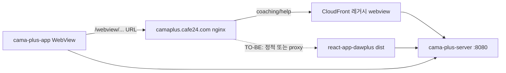

# WebView 화면 매핑 — RN `cama-plus-app` ↔ `react-app-dawplus`

> **갱신:** 2026-06-04  
> **호스트:** `https://camaplus.cafe24.com`  
> **nginx (TO-BE):** `deploy/nginx/cama-patient-spa-locations.conf` → `/opt/cama/www/react-app`  
> **신규 앱:** `react-app-dawplus` — 동일 API(`/api/webview/*`) + TanStack 경로 (`/home`, `/coaching/...`)

---

## 1. 아키텍처 요약



| 레이어 | 역할 |
|--------|------|
| RN | JWT 보유, WebView URL 로드 |
| nginx | 경로별 CloudFront 또는 (예정) 신규 빌드 |
| react-app-dawplus | WebView **대체 UI** — 파일 라우팅, Jotai+Query |
| API | RN REST + WebView POST/GET (`/api/webview/*`) |

---

## 2. RN WebView URL → 신규 SPA 경로

| RN 화면 | WebView URL (RN) | 신규 SPA 경로 | 구현 상태 | API (webview) |
|---------|------------------|---------------|-----------|---------------|
| 건강코칭 메인 | `/webview/coaching/{loginId}` | `/coaching?wvLoginId=` | ✅ redirect+bootstrap | `getCoachingProgressList`, codeList |
| 코칭 카테고리 | `/webview/coaching/{categoryCd}/{loginId}` | `/coaching/{sleep\|meal\|physical\|mind}?wvLoginId=` | ✅ A~E | answerList, step, codeList |
| 웰빙 | `/webview/coaching/wellbeing/{loginId}` | `/wellbeing?wvLoginId=` | ✅ redirect+bootstrap | wellbeing resource list |
| 도움말 | `/webview/help` | `/help`, `/webview/help` | ✅ `HelpPageContent` | — |
| 치료정보 상세 | `/webview/treatment/{seq}` | `/content/detail/{id}` | ✅ redirect | `GET api/webview/contents/{seq}/view` |
| _(앱 네이티브 홈)_ | — | `/home` | ✅ | track check, schedule, contents |
| _(앱 네이티브 일정)_ | — | `/schedule` | ✅ | schedule, monthly |
| _(즐겨찾기)_ | — | `/favorite` | ✅ | favoriteList, favoriteSave |

**loginId in URL:** RN은 path에 `loginId` 포함. 신규 SPA는 `POST /api/webview/account/me`로 **`wvLoginId` search** 또는 JWT 세션. `src/lib/webview/bootstrapSession.ts`, `_auth` `beforeLoad`에서 부트스트랩.

---

## 3. 코칭 WebView 상세 (가장 큰 영역)

### 3.1 카테고리 코드

| type (SPA route) | categoryCd (API) | 설명 |
|------------------|------------------|------|
| `sleep` | A | 수면 |
| `meal` | B | 식사 |
| `physical` / `exercise` | C | 운동 |
| `mind` | D | 마음 (허브 라우트) |

허브: `/coaching/coaching/$type/$day` — `COACHING_DATA`, `useUserAnswerInfoList`.

### 3.2 일차(day) 라우트

| 패턴 | 파일 수 | 비고 |
|------|---------|------|
| `/coaching/coaching/meal/day{N}/` | day0~16 | step1~3, `_shared` 템플릿 |
| `/coaching/coaching/sleep/day{N}/` | day0~16 | 일부 day만 step |
| `/coaching/coaching/physical/day{N}/` | day0~16 | 운동 |

Vite `routeFileIgnorePattern`으로 `stepN`, `_shared`는 라우트 트리에서 제외 → **DayStepFlow** 등에서 동적 step.

### 3.3 코칭 API (SPA `apis/api/webview/coaching.ts`)

| 기능 | 메서드 | 경로 |
|------|--------|------|
| 답변 저장 | PUT | `api/coaching/service/answerList` |
| step 저장 | PUT | `api/coaching/service/step` |
| 진행 목록 | POST | `api/coaching/service/getCoachingProgressList` |
| 사용자 답변 | POST | `api/coaching/service/userAnswerInfoList` |
| 운동 클래스 | POST | `api/coaching/service/getExerciseUserClassInfo` |
| 코드 목록 | POST | `api/coaching/service/codeList` |

---

## 4. 홈·일정·콘텐츠 WebView API

### 4.1 홈 `/home`

| UI 블록 | 조건 | webview / API |
|---------|------|----------------|
| Header, DailyCarousel | 암정보 설정 완료 | `track/service/check`, `stepList` |
| ScheduleSection | 공통 | `webview/schedule`, `monthly` |
| SearchArea | 공통 | `contents/list` (search) |
| CancerInfoList | 미설정 | `hospital` list, `service/apply` |
| HealthCoaching | 설정 완료 | → `/coaching` 링크 |

### 4.2 일정 `/schedule`

| 기능 | API |
|------|-----|
| 일별 일정 | GET `api/webview/schedule?d=&acSeq=` |
| 월별 | GET `api/webview/schedule/monthly` |
| 완료/취소 | POST `.../done/{acSeq}`, `unDone` |
| CRUD | POST/PUT/DELETE `webview/schedule/...` |

### 4.3 콘텐츠 `/favorite`, `/content/detail/$id`

| 기능 | API |
|------|-----|
| 목록/검색 | POST `api/webview/contents/list` |
| 상세 | GET `api/webview/contents/{seq}/view` |
| 즐겨찾기 | GET/PUT favoriteList, favoriteSave |

### 4.4 웰빙 `/wellbeing`

| 기능 | API |
|------|-----|
| 리소스 | POST `api/contents/wellbeing/resources/getWellbeingResourceList` |

### 4.5 계정

| 기능 | API |
|------|-----|
| 내 정보 | POST `api/webview/account/me` `{ loginId }` |
| 병원 | POST `api/webview/account/hospital` `{ seq }` |

---

## 5. nginx / Cafe24 배포

| 경로 | nginx | SPA |
|------|-------|-----|
| `/webview/*` | `root /opt/cama/www/react-app` | 진입·redirect |
| `/coaching/*`, `/wellbeing`, `/help`, `/content/*` | 동일 | redirect 후 화면 |
| `/assets/*` | 동일 (immutable cache) | Vite 번들 |

가이드: [CAFE24_REACT_APP_DEPLOY.md](CAFE24_REACT_APP_DEPLOY.md) · `npm run build:cafe24` · `deploy-react-app-cafe24.ps1 -ApplyNginx`

---

## 6. 로그인 연동 (2026-06-04 반영)

| 항목 | 구현 |
|------|------|
| API | `POST /api/auth` — principal, credentials, firebase |
| 토큰 | SecureLS + `api_key: Bearer` |
| 가드 | `_auth` beforeLoad → `/login` redirect |
| 테스트 | `node scripts/test-login-api.mjs` — 401 한국어 메시지 확인됨 |

WebView 전용: RN이 로그인한 뒤 SPA에 **토큰 주입**하면 `/login` 생략 가능.

---

## 7. 미매핑·레거시

| 항목 | 비고 |
|------|------|
| `/webview/help` | 신규 SPA 라우트 없음 |
| `/report`, `/reporting` | 인지 리포트·데모 (앱 WebView 아님) |
| `/dashboard-api` | API 대조 대시보드 (개발용) |
| `api/hospital/{seq}/doctor/list` | SPA는 `api/webview/hospital/...` 혼용 — 정리 여지 |

---

## 8. QA 체크리스트 (WebView 기능)

```text
[ ] 로그인 → /home (JWT)
[ ] track 미설정 → CancerInfoList / 설정 → Carousel
[ ] /schedule 달력·완료 토글
[ ] /favorite · 상세 /content/detail/1
[ ] /coaching → sleep/meal/physical day step 저장
[ ] /wellbeing 리스트
[ ] RN WebView URL과 동일 쿠키/토큰 주입 E2E
```
